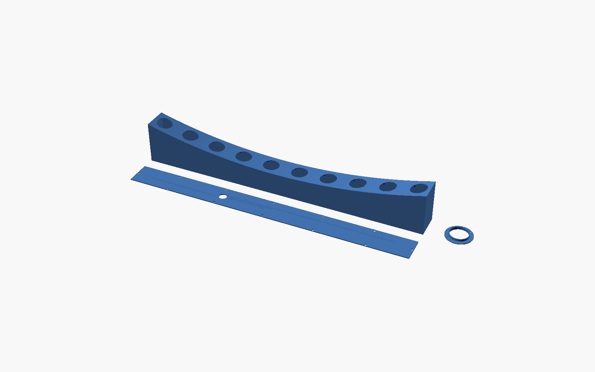

# what is?

A horizontal line array of 2" Tectonic BMRs.  4 left 4 right on outer sides for music, 1 left 1 right in middle for work computer.  Separate air chambers for each bank.  Wow.  All made with openscad from claue prompts.  Neat.  Fully Parameterized.  Great!

